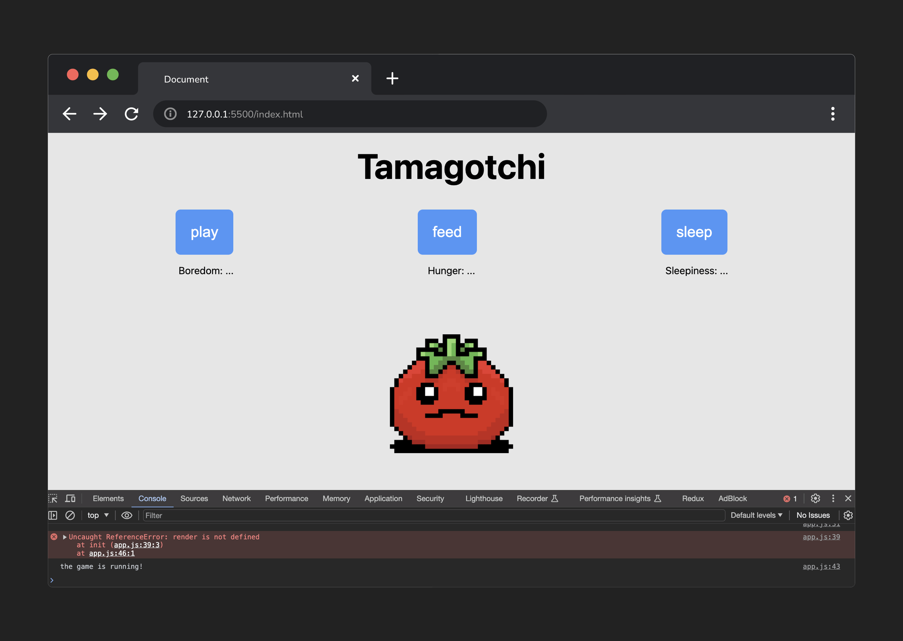

<h1>
  Tamagotchi Lab
  Exercise Parts 1-3
</h1>

## Step 1

Define the variables used to track the state of the game.

a. Create an object called `state` and give it three properties: `boredom`, `hunger`, and `sleepiness`. Each property will have an initial value of `0`.

b. Use a variable named `timer` to store the timer for the game.

c. Use a variable named `gameOver` to present if the player has lost the game.

> 💡 b and c will not need to hold a value when they are defined.

## Step 2

Store cached element references.

a. Make 3 constants to store the `spans` inside the 'stat-display' `section`.

> As an example, in a constant called `boredomStatEl`, store the element with an id of `boredom-stat`.

b. Make 3 constants to store the button elements inside of the 'controller' `section`.

> As an example, in a constant called `playBtnEl`, store the element with an id of `play`.

c. In a constant called `gameMessageEl`, store the element that displays the game's status on the page.

d. In a constant called `resetBtnEl`, store the button element that will allow the player to play again.

> 🚨 Don't forget to console.log() your cached element references to ensure you've grabbed the correct elements!

## Step 3

Upon loading, the game state should be initialized, and a function should be called to render this game state.

a. Create a function called `init`.

b. Call this `init` function so that it is invoked when the app loads.

> 🚨 Add a `console.log()` as a confirmation check inside this function. This helps to ensure you're calling the function you just created correctly!

c. Set `gameOver` to `false`.

d. Inside of the `init()` function, assign `timer` to a [`setInterval()`](https://developer.mozilla.org/en-US/docs/Web/API/setInterval) function. Pass `setInterval` a function named `runGame()` (we will create it in the next step) as the first argument, and `2000` as the second argument.

e. Create a function named `runGame`. For now, the only job of the function should be to log `'the game is running!'`

> 💡 Check your console to confirm this is working - you should see `the game is running!` log to the console every 2 seconds.

f. Finally, call a function named `render()`.

> 🚨 As we have not made this function yet, this will throw an error until you complete step 4a!

