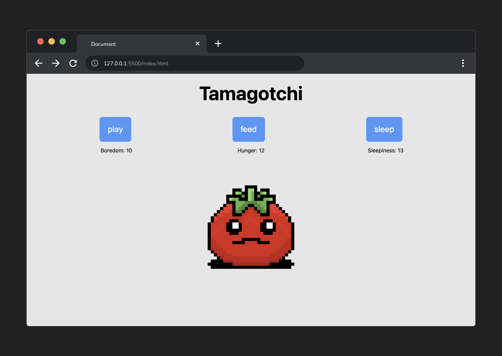
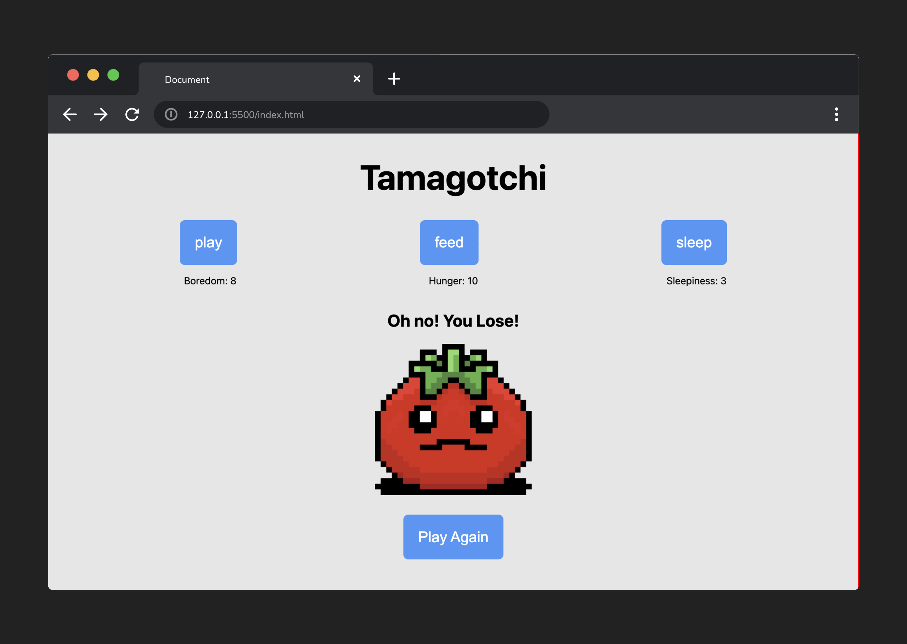

<h1>
  <span class="headline">Tamagotchi Lab</span>
  <span class="subhead">Exercise Parts 4-5</span>
</h1>

## Step 4

### The state of the game should be rendered to the user

a. Create an empty function called `render`, then set it aside for now.

b. Create a function called `updateStates`.

c. In the `updateStates()` function, increment each property of  `state` by a random number between 0 and 3.

> 💡 While not strictly necessary, a helper function that handles the logic of generating a random number might be helpful here!
>
> Check out [MDN's `Math.random()` documentation](https://developer.mozilla.org/en-US/docs/Web/JavaScript/Reference/Global_Objects/Math/random) for more info on generating random numbers.

d. Remove the console.log in `runGame()`. Then, inside `runGame()`, invoke `updateStates()` and `render()`.

e. Inside `render()`, assign each cached stat element's [`textContent`](https://developer.mozilla.org/en-US/docs/Web/API/Node/textContent) to their corresponding property in `state`.

> 💡 For example, `boredomStatEl`'s `textContent` would be set equal to `state.boredom`.

---

Let's pause a second to run through the current flow of our program. When the page loads, we call `init()`. `init()` starts a timer that calls `runGame()` every 2000 milliseconds.

`runGame()` calls `updateStates()`, which increments each of the stats in our `state` variable by a random number between 0-3. After this happens, `runGame()` calls `render()`. The `render()` function updates the user interface to reflect the newly updated state of each stat.

Then, around two seconds later, `runGame()` is called again. Our state updates. We render these changes to the UI. Two seconds later, `runGame()` is called again - the whole process repeats on and on.

For now, we don't have any condition by which this timer will end, so we've made something of an endless loop! We'll address that in the next step!



## Step 5

### Handle the game over logic

a. Create a function called `checkGameOver`.

b. Inside this new function, create an `if` statement that checks if any `state` property has a value of 10 or more.

c. If so, set `gameOver` to `true`.

d. Inside of `runGame()`, invoke `checkGameOver()` between `updateStates()` and `render()`.

> 💡 The order in which we invoke these functions matters. Our `checkGameOver()` function references `state` to determine whether the game over condition has been met. If we do this before `updateState()` has a chance to run, we'll always be referencing the old state!

e. In `render()`, add an `if` statement that checks if `gameOver` is `true`. If it is, end the countdown using the `Window`'s `clearInterval()` method. You'll need to pass the `timer` you created earlier as an argument to the method. See [MDN's `clearInterval()` documentation](https://developer.mozilla.org/en-US/docs/Web/API/Window/clearInterval) for more details about how this works.

#### A quick aside

At this stage, the logic for ending the game is complete! However, aside from the numbers no longer incrementing, the user will have no way to know they have lost. So, next, we'll need to render a message to the user.

In the CSS of the starter code, we created a rule for the `hidden` class, which sets the `visibility` of an element with this class to `hidden`.

```css
.hidden {
  visibility: hidden
}
```

We also gave this class to two elements inside this HTML section:

```html
<section class="game-state-wrapper">
  <h2 id="message" class="hidden">
    Oh no! You Lose!
  </h2>
  
  <button id="restart" class="hidden">Play Again</button>
</section>
```

As a result, both the `h2` and the `button` are hidden by default.

When the game ends, we want to remove these two instances of the 'hidden' class.

f. Inside the `if` statement in `render()`, remove the "hidden" class from the `resetBtnEl` and the `gameMessageEl`.

> 💡 Check out the docs on [classList](https://developer.mozilla.org/en-US/docs/Web/API/Element/classList) for help if you need it!

Give it a test! When the loss conditions are met, you should see both the `h1` and the `button` element appear!


