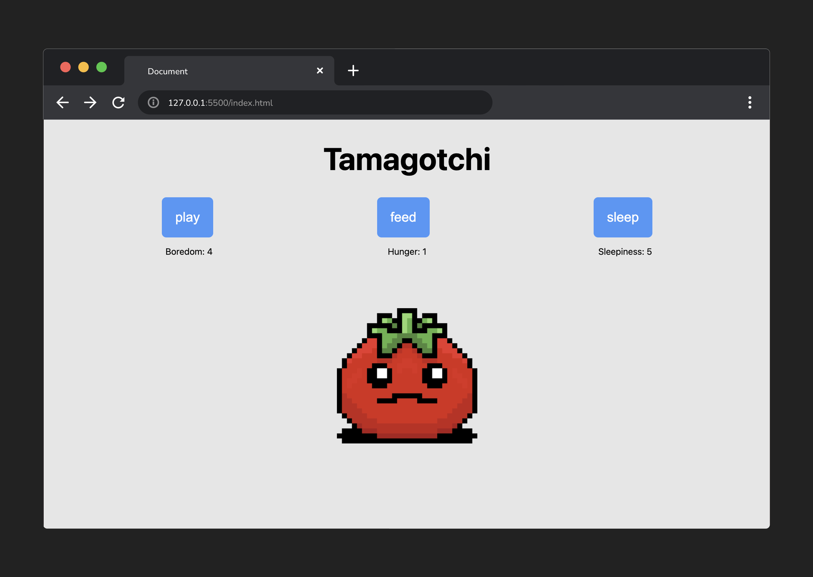

<h1>
  Tamagotchi Lab
  Exercise Parts 6-7
</h1>

## Step 6

### Handle each instance of a player clicking a button with a `handleClick()` function

a. Make a function called `playBtnClick`.

b. Inside this new function, set `state.boredom` to `0`.

c. Then, invoke `render()`.

d. Next, attach an [event listener](https://developer.mozilla.org/en-US/docs/Web/API/EventTarget/addEventListener) to `playBtnEl`. When a user clicks, we want to invoke `playBtnClick()`.

> 💡 Remember, we're passing a function that we only want to call WHEN a click event is registered. As a result, we don't call the function when we pass it as an argument.

e. Repeat steps a-d for the 'feed' and 'sleepiness' buttons.

> 🚀 As a Level Up, consider how we could make this process more DRY.

Test it out - as a user, you should now be able to keep your Tamagotchi happy!

## Step 7

### Create reset functionality

a. Add an event listener to `resetBtnEl`. When a click occurs, invoke `init()`.

b. To the top of `init()`, add the 'hidden' class to `resetBtnEl` and `gameMessageEl`.

c. Set the value of each stat property in `state` to `0`.

---

Congrats on coding a cool game of Tamagotchi! 🎉

Hopefully, you're inspired to apply the process we followed today to code another game!

