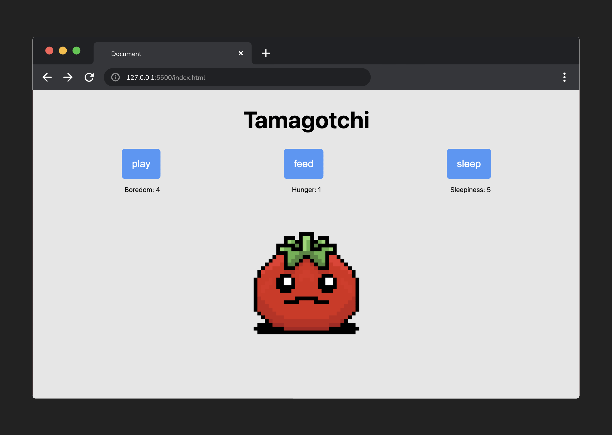

<h1>
  <span class="headline">Tamagotchi Lab</span>
  <span class="subhead">Exercise Intro</span>
</h1>

In this lab, you will build a Tamagotchi game incorporating the web technologies and techniques you've worked with thus far:

- HTML
- CSS
- JavaScript
- DOM Manipulation



## What is Tamagotchi?

Tamagotchi was a huge toy fad in the late '90s and early 2000s - essentially, they were small pet simulators that entrusted the care of a digital creature to a player. We will be building a very paired-down game based on this premise. For our purposes, the game of Tamagotchi consists of the following:

- It's a one-player game.
- The player is tasked with keeping a creature happy.
- Each creature a player 'raises' has three main statistics.
- The stats are:
  - Boredom
  - Hunger
  - Sleepiness
- To keep the creature happy, a player must keep three stats within a given range - greater than 0 and less than 10.

## Minimum Requirements

- Display three buttons when the page is initially displayed.
- Display three stats that randomly increment a value between 0 and 3 at a set interval.
- A player can click a button to set the corresponding stat to `0`.
- Include loss logic and display a message when the player has lost.
- Provide a `Play Again` button that will reset the game.

## Items of note

- Using `id`/`class` attributes will help you target elements for styling and wiring up your click event listeners. These have already been added for you!
- Programs, including games, frequently focus on manipulating and displaying data to a user. Decide on the data structures held in variables you will use to maintain the game's state (its current data or status).
- Lots of little functions with small jobs help accomplish big things!

## Pseudocode

Pseudocode is a detailed description of what an application must do, written in natural language instead of a particular programming language.

Well-written pseudocode should be easily translated into actual code. The best way to get started is to start with the big picture of what the app needs to do:

```javascript
// 1) Define the required variables used to track the state of the game.

// 2) Store cached element references.

// 3) Upon loading, the game state should be initialized, and a function should 
//    be called to render this game state.

// 4) The state of the game should be rendered to the user.

// 5) Handle the game over logic. 

// 6) Handle each instance of a player clicking a button with the use of a 
//    `handleClick()` function.

// 7) Create reset functionality.
```

Next, we can start expanding on these steps with detailed pseudocode.

The remainder of this exercise walks through those steps. Follow along from start to finish, and you'll have a complete game of Tamagotchi that meets the minimum requirements!
